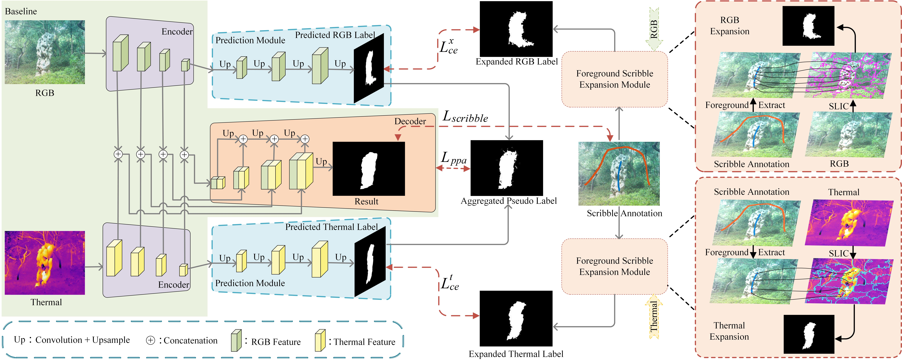

# Scribble-Supervised RGB-T Salient Object Detection
The  [paper](RGBTScribble.pdf) has been accepted by ICME2023.




# RGBT-S dataset (RGB-T Scribble dataset)
链接：https://pan.baidu.com/s/1Wq_bxAkblK3wxyNpirU0Vg 
提取码：kcvc 


# Pretraining Parameters
链接：https://pan.baidu.com/s/10hcP9NjB8Z9VC9kzSt1eCQ 
提取码：9eaa 

# Model Parameters
链接：https://pan.baidu.com/s/1DV_cKbjx5ZzRcomJCPcHSA 
提取码：it8k 

# Evaluation Code
链接：https://pan.baidu.com/s/1W9L-twMVlM8CXfWJC40Y_g 
提取码：t2vw 

# RGB-T Saliency Maps
链接：https://pan.baidu.com/s/1VGEHFnMm2fAiK_etfDRmSw 
提取码：kd42 

### Citation

If you find the information useful, please consider citing:

```
@inproceeding{liu2022,
  author={Liu, Zhengyi and  Huang, Xiaoshen and  Zhang, Guanghui and  Fang, Xianyong and  Wang, Linbo and  Tang, Bin},
  journal={2023 IEEE International Conference on Multimedia and Expo (ICME)}, 
  title={Scribble-Supervised RGB-T Salient Object Detection}, 
  pages={2369--2374},
  year={2023}}
```
If you have any question, please email  liuzywen@ahu.edu.cn
